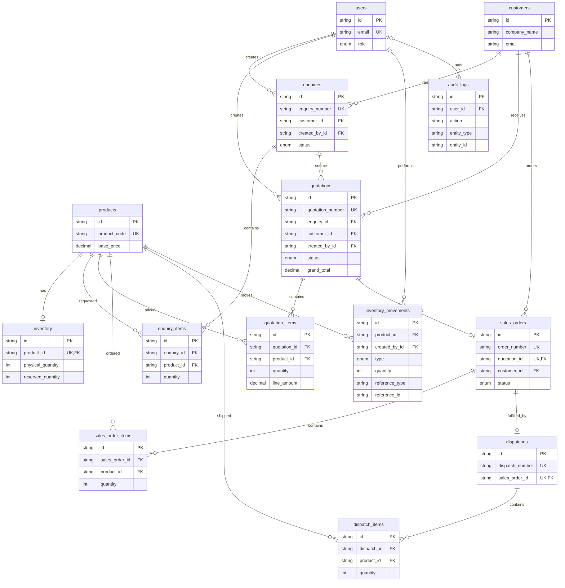

# IndustrialFlow ER diagram

This diagram matches `backend/prisma/schema.prisma`, including the operational supporting tables `dispatch_items`, `inventory_movements`, and `audit_logs`.

The unique quotation-to-order and order-to-dispatch relationships are important idempotency guarantees, not merely presentation choices.

